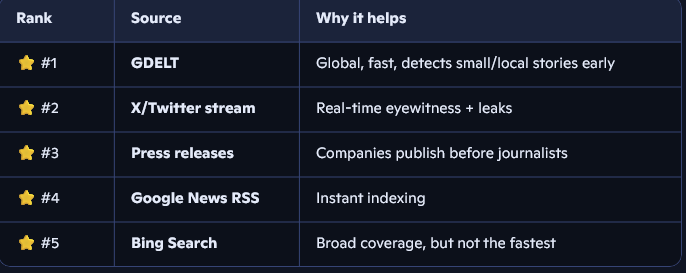

# AI Early Signal Intelligence Newsletter

Production-ready intelligence newsletter platform deployed on Netlify. Monitors 12+ data sources, detects market-moving signals, and delivers them via a 3-tier alert system.

## Current Phase: Phase 1 — Daily Digest

**Status:** Working newsletter with all data sources, sent once per day.
**Storage:** Netlify Blobs only.
**Cron:** Daily digest at 07:00 UTC.

## Quick Start

```bash
# Install dependencies
npm install

# Copy environment template
cp .env.example .env

# Configure your API keys in .env
# Required for Phase 1:
# - OPENAI_API_KEY
# - EMAIL_API_KEY (Resend)
# - BING_SEARCH_API_KEY
# - FRED_API_KEY
# - FINNHUB_API_KEY
# - SAM_GOV_API_KEY
# - CRON_SECRET
# - UNSUBSCRIBE_SECRET

# Start local development server
npm run dev

# Test subscription
curl -X POST http://localhost:8888/.netlify/functions/subscribe \
  -H "Content-Type: application/json" \
  -d '{"email":"test@example.com"}'

# Test daily digest (manual trigger)
curl -X POST http://localhost:8888/.netlify/functions/send-newsletters \
  -H "x-cron-secret: your_secret"
```

## Deploy to Netlify

```bash
# Install Netlify CLI
npm install -g netlify-cli

# Login and link project
netlify login
netlify init

# Set environment variables in Netlify dashboard
# Or via CLI:
netlify env:set OPENAI_API_KEY "your-key"
netlify env:set EMAIL_API_KEY "your-key"
# ... repeat for all required vars

# Deploy
netlify deploy --prod
```

## Project Structure

```
project-root/
├── netlify.toml              # Netlify config with cron schedule
├── package.json              # Dependencies
├── .env.example              # Environment variables template
├── index.html                # Subscription landing page
└── netlify/
    └── functions/
        ├── subscribe.mjs         # POST /subscribe
        ├── unsubscribe.mjs       # GET /unsubscribe?token=xxx
        ├── send-newsletters.mjs  # CRON daily digest 07:00 UTC
        └── _lib/                 # Shared library modules
            ├── news.mjs          # Bing Search
            ├── rss.mjs           # RSS parser
            ├── regional.mjs      # Regional RSS feeds
            ├── macro.mjs         # FRED API
            ├── contracts.mjs     # SAM.gov + USASpending
            ├── edgar.mjs         # SEC EDGAR
            ├── crypto.mjs        # CoinGecko
            ├── market.mjs        # Finnhub
            ├── watchlist.mjs     # Cross-source filtering
            ├── db.mjs            # Netlify Blobs wrapper
            ├── ai.mjs            # OpenAI generation
            ├── email.mjs         # Resend sender
            └── token.mjs         # HMAC tokens
```

## API Cost Reference

| Service | Cost | Key Required | Rate Limit |
|---------|------|--------------|------------|
| RSS feeds (all) | ✅ Free | ❌ None | Unlimited |
| USASpending.gov | ✅ Free | ❌ None | Generous |
| SEC EDGAR | ✅ Free | ❌ None* | 10 req/sec |
| CoinGecko | ✅ Free | ❌ None | 30 calls/min |
| FRED | ✅ Free | ✅ Instant | 120 req/min |
| SAM.gov | ✅ Free | ✅ 1-10 days | 1,000 req/day |
| Finnhub | ✅ Free | ✅ Instant | 60 calls/min |
| Netlify Blobs | ✅ Free | Built-in | — |
| Resend | 💰 $0-20/mo | ✅ Yes | 3K-50K emails/mo |
| Bing Search | 💰 Paid | ✅ Yes | Per plan |
| OpenAI | 💰 Paid | ✅ Yes | Per plan |

*EDGAR requires User-Agent header, not an API key.

## License

ISC

Future plan

If you want to be truly ahead of mainstream media:
Add GDELT + Press Releases
These two alone will give you:
- Early signals
- Global coverage
- Raw information before journalists rewrite it
Then use AI to:
- Filter
- Summarize
- Rank by importance
- Turn into a clean briefing
That’s how you build a real intelligence system, not just another news digest

Yes — if your goal is to be ahead of mainstream news, you need at least one early-signal source.
Here’s the ranking of what will give you the biggest advantage:


 in keep

🧭 My recommendation for your app
Given your current stack, the single best next addition is:
➤ GDELT + Press Releases
This combination gives you:
- Global early signals
- Corporate early signals
- Zero cost
- No API keys
- High-frequency updates
- Perfect raw material for AI summarization
This is how you build a true intelligence briefing system, not just another news aggregator.
